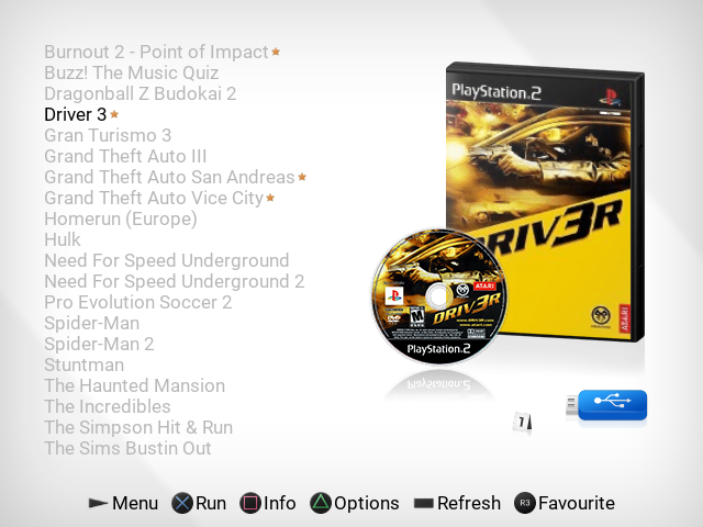
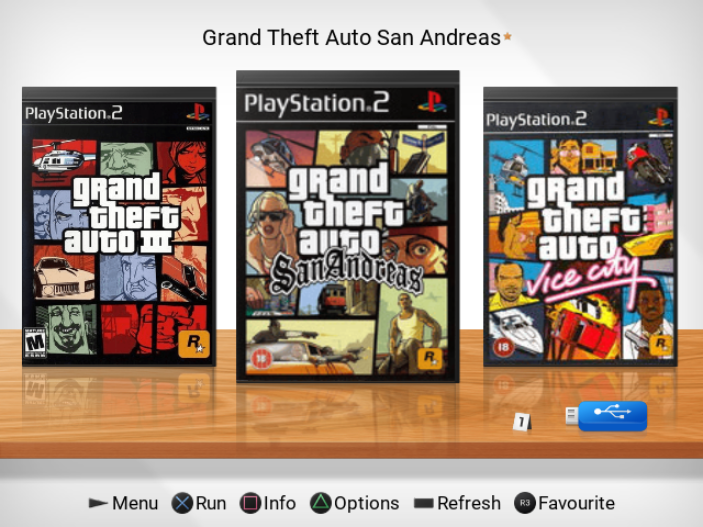

# Unoffical-Open-PS2-Loader

Copyright 2013, Ifcaro & jimmikaelkael<br/>
Copyright 2024-2025, KrahJohilto, Wolf3s and Ripto<br/>
Licensed under Academic Free License version 3.0
Review the LICENSE file for further details.

[](https://github.com/NathanNeurotic/uOPL/actions/workflows/compilation.yml)
[](https://www.codacy.com/gh/NathanNeurotic/Unofficial-Open-PS2-Loader/dashboard?utm_source=github.com&utm_medium=referral&utm_content=NathanNeurotic/Unofficial-Open-PS2-Loader&utm_campaign=Badge_Grade)
[]([https://discord.gg/CVFUa9xh6B](https://discord.gg/hFRysYVReu))

## Introduction

U-Open PS2 Loader (u-OPL) is a 100% Open source game and application loader based on [OPL](https://github.com/ps2homebrew/Open-PS2-Loader) for
the PS2 and PS3 units. This version uses stable features that at the moment was not merged plus unique features.
<details>
  <summary> <b> Changes in uOPL </b> </summary>
<p>

  * uOPL uses a slightly older build environment in an attempt to increase stability, more akin to OPL r2049
  * Multi USB works without issues (workaround)
  * ATA HDD support ala grimdoomers fork
  * UDPBD support (as a build variant) ala tihmstar & el_isra forks (untested) - likely needs more work
  * Favourites Menu
  * Optional per-game Neutrino core loading for increased compatibility
  * Additional Mode 7 ala Neutrino (works with both Neutrino and OPL core)
  * Legacy apps paths with `mass:` work
  * Two new built in themes `<uOPL>` & `<uOPL-CF>`
  * Additional theme options
  * Debug builds have the option to send LOGs to a BDM device
  * Disable all button for cheats selection menu
  * Cancel pending ART requests at launch (should stop a crash that occurs when traversing the games list quickly and suddenly launching a title)

### Neutrino Support
Neutrino needs to be stored on either `mc0:NEUTRINO/neutrino.elf` or `mc1:NEUTRINO/neutrino.elf` with the usual setup of `config` and `modules` subfolders.<br>
In game settings you will find an option `Loader Core` with the options of `<OPL>` or `Neutrino`<br><br>
Supported devices: `USB` `MX4SIO` `HDD (ATA)` `iLink` `UDPBD - untested` `HDD (APA) - untested (seems hit & miss for some games)`<br><br>
Neutrino does not support:<br>
`ZSO Format` `USBExtreme Format` (Will result in `<OPL>` core being used instead even if `Neutrino` is selected)<br>
`PADEMU` `GSM` `Cheats` (Will result in `Neutrino` still being used however these features will not be applied because Neutrino uses a diffrent sets of modules than OPL and u-OPL)<br><br>
Get [Neutrino](https://github.com/rickgaiser/neutrino/releases)

### Additional Theme Options
These are all optional and will use default values if omitted.

| Key                         | Description                                                                                                          |
| --------------------------- | -------------------------------------------------------------------------------------------------------------------- |
| `wsX`                       | Sets theme element posX position in widescreen (avoids the need for seperate 4:3 and 16:9 theme cfgs)                |
| `skip`                      | If enabled will skip rendering of StaticImage types if there is no currently selected item                           |
| `reflection`                | If enabled will render a reflection of GameImage or Coverflow types (not recommended for faked perspective images)   |
| `plasma_blend_color`        | Optional secondary blend colour for plasma (now you can mix bg & blend colour, previously it was only bg & black)    |
| `Coverflow`                 | New type will render 3 covers at a time, works with overlays and reflection etc                                      |
| `aligned=2`                 | New value for "aligned" to right justify                                                                             |
| `use_settings_bg=1`         | If enabled all menus will display `settings_bg.png` from your theme instead of traditional plasma for the background |




</p>
</details>

<details>
  <summary> <b> Release types </b> </summary>
<p>

Open PS2 Loader bundle included several types of the same OPL version. These
types come with more or fewer features included.

| Type (can be a combination) | Description                                                                             |
| --------------------------- | --------------------------------------------------------------------------------------- |
| `Release`                   | Regular OPL release with GSM, IGS, PADEMU, VMC, PS2RD Cheat Engine & Parental Controls. |
| `DTL_T10000`                | OPL for TOOLs (DevKit PS2)                                                              |
| `IGS`                       | OPL with InGame Screenshot feature.                                                     |
| `PADEMU`                    | OPL with Pad Emulation for DS3 & DS4.                                                   |
| `RTL`                       | OPL with the right to left language support.                                            |

</p>
</details>

<details>
  <summary> <b> How to use </b> </summary>
<p>

U-OPL uses the following directory tree structure across HDD, SMB, and
USB modes:

| Folder | Description                                          | Modes       |
| ------ | ---------------------------------------------------- | ----------- |
| `CD`   | for games on CD media - i.e. blue-bottom discs       | USB and SMB |
| `DVD`  | for DVD5 and DVD9 images (if filesystem supports +4gb files) | USB and SMB |
| `VMC`  | for Virtual Memory Card images - from 8MB up to 64MB | all         |
| `CFG`  | for saving per-game configuration files              | all         |
| `ART`  | for game art images                                  | all         |
| `THM`  | for themes support                                   | all         |
| `LNG`  | for translation support                              | all         |
| `CHT`  | for cheats files                                     | all         |

U-OPL will automatically create the above directory structure the first time you launch it and enable your favorite device.

For HDD (APA) users, OPL will read `hdd0:__common/OPL/conf_hdd.cfg` for the config entry `hdd_partition` to use as your OPL partition.
If not found a config file, a 128Mb `+OPL` partition will be created. You can edit the config if you wish to use/create a different partition.
All partitions created by OPL will be 128Mb (it is not recommended to enlarge partitions as it will break LBAs, instead remove and recreate manually with uLaunchELF at a larger size if needed).

</p>
</details>

<details>
  <summary> <b> USB/MX4SIO/iLink/HDD (ATA) </b> </summary>


Game files should be *ideally* defragmented either file by file or by whole drive.
Games larger than 4GB must be stored on a device formatted with exFAT, or if the device is using FAT32, the USBExtreme format must be used (see OPLUtil or USBUtil programs).
We do **not** recommend using any defrag programs. The best way for defragmenting - copy all files to pc, format USB, copy all files back.
Repeat it once you faced defragmenting problem again.

> NOTE: partial file fragmentation is supported (up to 64 fragments!) since OPL v1.2.0 - rev1893


</p>
</details>

<details>
  <summary> <b> SMB </b> </summary>
<p>

For loading games by SMB protocol, you need to share a folder (ex: PS2SMB)
on the host machine or NAS device and make sure that it has full read and
write permissions. USB Advance/Extreme format is optional - \*.ISO images
are supported using the folder structure above.

</p>
</details>

<details>
  <summary> <b> HDD (APA)</b> </summary>
<p>

For PS2, 48-bit LBA internal HDDs up to 2TB are supported. HDD should be
formatted with the APA partition scheme. OPL will create the `+OPL` partition on the HDD.
To avoid this, you can create a text file at the location `hdd0:__common:pfs:OPL/conf_hdd.txt`
that contains the preferred partition name (for example `__common`).

</p>
</details>

<details>
  <summary> <b> Cheats </b> </summary>
<p>

OPL accepts `.cht` files in PS2RD format. Each cheat file corresponds to a specific game and must be stored in the `CHT` directory on your device.
Cheats are structured as hexadecimal codes, with proper headers as descriptions to identify their function.
You can activate cheats via OPL's graphical interface. Navigate to a games settings, enable cheats and select the desired mode.

### cheat modes

  * Auto Select Cheats:  
This mode will enable and apply all cheat codes in your `.cht` file to your game automatically.

  * Select Game Cheats:  
When enabled a cheat selection menu will appear when you launch a game. You can navigate the menu and disable undesired cheats for this launch session. `Mastercode`s cannot be disabled as they are required for any other cheats to be applied.

</p>
</details>

<details>
  <summary> <b> NBD Server </b> </summary>
<p>

OPL now uses an [NBD](https://en.wikipedia.org/wiki/Network_block_device) server to share the internal hard drive, instead of HDL server.
NBD is [formally documented](https://github.com/NetworkBlockDevice/nbd/blob/master/doc/proto.md) and developed as a collaborative open standard.

The current implementation of the server is based on [lwNBD](https://github.com/bignaux/lwNBD), go there to contribute on the NBD code itself.

The main advantage of using NBD is that the client will expose the drive to your operating system in a similar way as a directly attached drive.
This means that any utility that worked with the drive when it was directly attached should work the same way with NBD.

OPL currently only supports exporting (sharing out) the PS2's drive.

You can use `hdl-dump`, `pfs-shell`, or even directly edit the disk in a hex editor.

For example, to use `hdl_dump` to install a game to the HDD:

  * Connect with your choosen client (OS specific)
  * Run `hdl_dump inject_dvd ps2/nbd "Test Game" ./TEST.ISO`
  * Disconnect the client.

To use the NBD server in OPL:

  * Grab the latest beta version (OPL 1.1.0 (current stable) has some bugs in the NBD server) - go to the [Releases](https://github.com/ps2homebrew/Open-PS2-Loader/releases) section and grab the one at the top.
  * Ensure OPL is configured with an IP address (either static or DHCP).
  * Open the menu and select "Start NBD server". Once it's ready, it should update the screen to say "NBD Server running..."
  * Now you can connect with any of the following NBD clients.

### nbd-client

Supported: Linux, [Windows with WSL and custom kernel](https://github.com/microsoft/WSL/issues/5968)

nbd-client requires nbd kernel support. If it isn't loaded,
`sudo modprobe nbd` will do.

list available export:

```sh
nbd-client -l 192.168.1.45
```

connect:

```sh
nbd-client 192.168.1.45 /dev/nbd1
```

disconnect:

```sh
nbd-client -d /dev/nbd1
```

You'll generally need sudo to run this commands in root or
add your user to the right group usually "disk".

### nbdfuse

Supported: Linux, Windows with WSL2

list available export:

```sh
nbdinfo --list nbd://192.168.1.45
```

connect:

```sh
mkdir ps2
nbdfuse ps2/ nbd://192.168.1.45 &
```

disconnect:

```sh
umount ps2
```

### wnbd

Supported: Windows

[WNBD client](https://cloudbase.it/ceph-for-windows/).
Install, reboot, open elevated (with Administrator rights) [PowerShell](https://docs.microsoft.com/en-us/powershell/scripting/windows-powershell/starting-windows-powershell?view=powershell-7.1#how-to-start-windows-powershell-on-earlier-versions-of-windows)

connect:

```sh
wnbd-client.exe map hdd0 192.168.1.22
```

disconnect:

```sh
wnbd-client.exe unmap hdd0
```

### Mac OS

Not supported.

</p>
</details>

<details>
  <summary> <b> ZSO Format </b> </summary>
<p>

As of version 1.2.0, compressed ISO files in ZSO format is supported by u-OPL.

To handle ZSO files, a python script (ziso.py) is included in the pc folder of this repository.
It requires Python 3 and the LZ4 library:

  ```sh
pip install lz4
```

To compress an ISO file to ZSO:

  ```sh
python ziso.py -c 2 "input.iso" "output.zso"
```

To decompress a ZSO back to the original ISO:

```sh
python ziso.py -c 0 "input.zso" "output.iso"
```

You can copy ZSO files to the same folder as your ISOs and they will be detected by u-OPL.
To install onto internal HDD, you can use the latest version of HDL-Dump.

</p>
</details>

<details>
  <summary> <b> PS3 BC </b> </summary>
<p>

Currently, supported only [PS3 Backward Compatible](https://www.psdevwiki.com/ps3/PS2_Compatibility#PS2-Compatibility) (BC) versions. So only [COK-001](https://www.psdevwiki.com/ps3/COK-00x#COK-001) and [COK-002/COK-002W](https://www.psdevwiki.com/ps3/COK-00x#COK-002) boards are supported. USB, SMB, HDD modes are supported.

To run u-OPL, you need an entry point for running PS2 titles. You can use everything (Swapmagic PS2, for example), but custom firmware with the latest Cobra is preferred. Note: only CFW supports HDD mode.

</p>
</details>

<details>
  <summary> <b> Some notes for DEVS </b> </summary>
<p>

Open PS2 Loader needs the [**latest PS2SDK**](https://github.com/ps2dev/ps2sdk)

</p>
</details>

<details>
  <summary> <b> u-OPL Archive </b> </summary>
<p>

Since 05/07/2021 every u-OPL build dispatched to the release section of this repository will be uploaded to a [mega account](https://mega.nz/folder/Ndwi1bAK#oLWNhH_g-h0p4BoT4c556A). You can access the archive by clicking the mega badge on top of this readme

</p>
</details>

<details>
  <summary> <b> Frequent Issues </b> </summary>
<p>

### u-OPL Freezes on logo or grey screen

 Sometimes u-OPL freezes when loading config files made by older u-OPL builds.
> hold __`START`__ while u-OPL initializes to make it skip the config loading, then, you can save your own settings.
> fixing the issue.

### Game freezes on white screen

> Main game executable could not be found. Either game is fragmented or image is corrupted

### u-OPL does not display anything on boot

> You may have selected a Video Mode which your TV does not support. Hold Triangle and Cross while u-OPL initializes to reset your video mode to "Auto".

</p>
</details>
